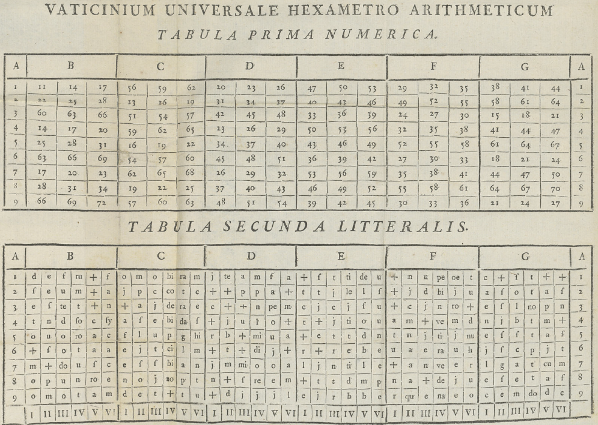

# ChatGPT, 1759 Edition



This repo holds the source and companion material for **"ChatGPT, édition 1759,"** a tribute to
Antoine de Falguerolles (1946–2023), built around a 1759 pamphlet by Pierre-Jean Migneret that
describes a "verse factory": a working oracle machine built from nothing but a letter table,
arithmetic, and a look-up table — and how closely its mechanism maps onto a modern LLM's.

- **Original version**: published as a blog post at
  [friendly.github.io/blog/posts/2026-08-chatgpt-1759](https://friendly.github.io/blog/posts/2026-08-chatgpt-1759/)
- **This repo**: the Quarto source for a *chronique* adapted for *Statistique et Société*, along
  with `oracle.R`, the R implementation of Migneret's Oracle that the chronique refers to instead
  of reprinting inline.

## Contents

- `chronique.qmd` — Quarto source for the chronique. `build.py` renders it to two Word versions:
  author–date citations with a Bibliography section, and every source as a footnote.
- `Annex.qmd` — "Annex 1": an executable companion document that sources `R/oracle.R` and shows
  what it does (the two examples from the pamphlet, the 54 words the Oracle can say, and how the
  design was found by implementing it), without reprinting the program itself.
- `R/` — the standalone, runnable implementation
  - `oracle.R` — Migneret's six-step procedure, base R (~220 lines)
  - `oracle-tests.R` — 40 checks against the worked examples printed in the pamphlet
  - `oracle-modern.R` — the Oracle asked four modern nine-word questions
  - `OracleR-design.md` — design notes: decisions, open questions, what implementing it revealed
- `images/` — figures used in the chronique and annex
- `references.yaml`, `references.bib` — bibliography data
- `assets/` — `apa7.csl`, `apa7-notes.csl` (the two citation styles) and `nosuppress.lua` (a Pandoc
  filter needed by the footnotes variant)
- `reference.docx` — Word style sheet used when rendering to `.docx`, built by
  `python/make_reference.py`
- `python/` — one-off generator scripts, not part of the build: `make_reference.py` (rebuilds
  `reference.docx`) and `make_notes_csl.py` (rederives `assets/apa7-notes.csl` from
  `assets/apa7.csl`). Run from the repo root, e.g. `python python/make_reference.py`.

## Running the R code

Each script in `R/` is self-contained. Open `chatgpt-1759.Rproj` in RStudio first so relative
paths resolve correctly, then source any script directly, e.g. `Rscript R/oracle-modern.R`.

## Rebuilding the chronique

```
python build.py          # both Word versions + the Annex
python build.py --pdf    # also export PDFs (via Word) for a visual check
```
