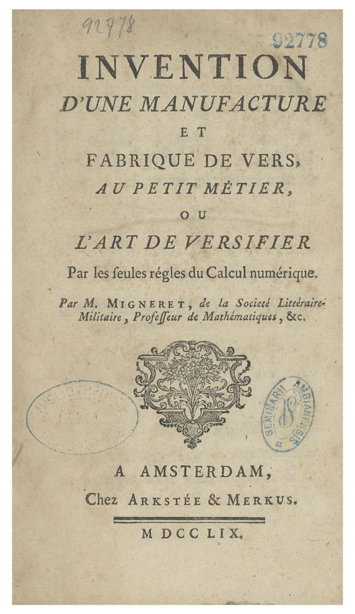
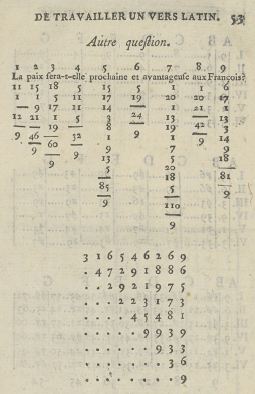

<!--
  Source for the Statistique et Société submission (chronique).
  Build both Word versions with:  python build.py
    - chronique_bibliography.docx : author-date citations + "Bibliography" section (journal standard, APA 7)
    - chronique_footnotes.docx    : all sources as footnotes, no Bibliography section
  Front-matter blocks use custom-style names defined in reference.docx (python/make_reference.py).
  build.py post-processes the .docx: page break before the Introduction, heading numbers "1 " not "1. ".
  Quotation marks: « » (with no-break spaces) for quotations, “ ” inside a quotation.
  Sections marked TODO(author) are open questions listed in NOTES.md.
-->

::: {custom-style="Titre article"}
ChatGPT, édition 1759
:::

::: {custom-style="Sous-titre article"}
Une «&nbsp;fabrique de vers&nbsp;» par le calcul numérique&nbsp;: hommage à Antoine de Falguerolles
:::

::: {custom-style="Auteur"}
Michael Friendly
:::

::: {custom-style="Front matter"}
Professeur ; Département de psychologie, Université York (Toronto, Canada) ; friendly@yorku.ca
:::

::: {custom-style="Front matter"}
Langue du texte&nbsp;: anglais
:::

::: {custom-style="Front matter"}
Résumé&nbsp;:
:::

::: {custom-style="Front matter"}
En 1759, Pierre-Jean Migneret, professeur de mathématiques et comptable, publie un court pamphlet décrivant une «&nbsp;fabrique de vers&nbsp;»&nbsp;: à partir d’une question, quelques opérations arithmétiques et deux tables permettent de composer un hexamètre latin. Son propos est satirique&nbsp;: les oracles de l’Antiquité n’étaient pas des révélations divines, mais le produit d’une procédure numérique dont les réponses, assez vagues pour convenir à toute issue, ne prouvaient rien. Cette chronique, écrite en hommage à Antoine de Falguerolles (1946-2023), qui m’avait signalé ce texte, suit pas à pas la méthode de Migneret et la compare à l’architecture des grands modèles de langage actuels&nbsp;: découpage en unités, représentation numérique, agrégation, mélange itéré, échantillonnage et table de sous-unités. Le parallèle est structurel et non seulement métaphorique, mais les différences d’échelle, de généralité et d’apprentissage sont décisives. Migneret a démystifié les oracles&nbsp;; savoir si le même argument démystifie ChatGPT reste, comme l’aurait dit Antoine, un exercice laissé au lecteur.
:::

::: {custom-style="Front matter"}
Mots clés&nbsp;: grands modèles de langage, intelligence artificielle, oracles, Migneret, de Falguerolles
:::

::: {custom-style="Front matter"}
Titre en anglais&nbsp;:
:::

::: {custom-style="Front matter"}
ChatGPT, 1759 Edition
:::

::: {custom-style="Front matter"}
A “verse factory” by numerical calculation: a tribute to Antoine de Falguerolles
:::

::: {custom-style="Front matter"}
Abstract&nbsp;:
:::

::: {custom-style="Front matter"}
In 1759, Pierre-Jean Migneret, a mathematics teacher and accountant, published a short pamphlet describing a “verse factory”: starting from a question, a few arithmetic operations and two tables produce a Latin hexameter. His aim was satirical: the oracles of antiquity were not divine revelations but the output of a numerical procedure whose answers, vague enough to fit any outcome, proved nothing. This column, written as a tribute to Antoine de Falguerolles (1946-2023), who drew the pamphlet to my attention, follows the steps of Migneret’s method and compares them with the architecture of modern large language models: tokenization, numerical representation, aggregation, iterated mixing, sampling and a stored table of sub-word units. The parallel is structural, not merely metaphorical, but the differences of scale, generality and learning are decisive. Migneret debunked oracles; whether the same argument debunks ChatGPT remains, as Antoine might have said, an exercise left to the reader.
:::

::: {custom-style="Front matter"}
Keywords&nbsp;: large language models, artificial intelligence, oracles, Migneret, de Falguerolles
:::

# Introduction

In February 2023, just a few months before he died, my dear friend Antoine de Falguerolles (1946-2023) sent me an email and a 1759 pamphlet by Pierre-Jean Migneret, *Invention d’une manufacture et fabrique de vers, au petit métier, ou l’art de versifier par les seules règles du calcul numérique* [@Migneret1759]. He said this might be «&nbsp;the first pamphlet against ChatGPT&nbsp;». Characteristically, he framed it as «&nbsp;a non-serious contribution&nbsp;». But when I recently translated and read it, I thought, «&nbsp;Holy Moly, it actually anticipates so many aspects of modern AI that it is worth a closer look.&nbsp;»

This was so typical of Antoine. He got me interested in the history of data visualization: the first time we met, in Toulouse, he showed me the 1864 volume of the *Albums de statistique graphique*, containing beautiful statistical graphics I never thought existed [@Friendly2008]. I was instantly hooked on the history of data visualization.

We later formed *Les Chevaliers* [@Friendly2023] to purchase an entire collection of these albums, published by Émile Cheysson for the Ministry of Public Works in France, 1879-1899. Over many years, Antoine would toss me many, many historical nuggets: the address in Paris where Charles Joseph Minard lived (32 rue du Bac); where Minard was buried (Montparnasse Cemetery, Paris) [@Friendly2020]; the birth certificate of André-Michel Guerry, which helped me track down his genealogy [@Friendly2007], and so on. Every one was an adventure.

I could go on. But the point is not a list. It is the reflection of the nimble and playful mind behind it: the statistician and historian who kept finding things that mattered, and sharing them with characteristic lightness. A fuller portrait of Antoine’s career is given in the tribute by Michel Armatte and Jean-Jacques Droesbeke [-@ArmatteDroesbeke2023]. This pamphlet, it turns out, mattered more than either of us realized.

# Migneret and his pamphlet

Migneret was a mathematics teacher and accountant, but not, as far as we know, a famous one. By 1798 he had published a textbook on commercial arithmetic. The 1759 pamphlet is his one brush with something larger. The full title (Figure 1) announces it cheerfully, translated roughly: *Invention of a verse factory and workshop, at the small trade, or the art of versifying by the sole rules of numerical calculation*—a factory for making verses on a small loom, by the rules of arithmetic alone. Isn’t that just ChatGPT without the loom? Let us call his machine the Oracle (“verse factory”), for reasons that will soon become clear.

The title page says «&nbsp;Published by Arkstée & Merkus, Amsterdam, 1759&nbsp;»—or so it claims. Arkstée & Merkus were real publishers, operating in Amsterdam and Leipzig, but a Dutch imprint on a French pamphlet was a common precaution for works that might offend someone; the true printer is unconfirmed. A satirical pamphlet debunking religious oracles had reason for a little cover.

::: {custom-style="Titre illustration"}
Figure 1: Title page of Migneret’s 1759 pamphlet
:::

::: {custom-style="Figure"}
{width=5.5cm fig-alt="Scanned title page of Migneret's 1759 pamphlet, Invention d'une manufacture et fabrique de vers"}
:::

::: {custom-style="Crédits illustration"}
Credits: scan of the 1759 original (public domain), IRIS-LILLIAD, Université de Lille.
:::

The brief preface, the *Avertissement*, is candid about how this pamphlet came to exist. Migneret had planned something grander, a large folio volume. The printer talked him down: «&nbsp;even if your book were a foolish trifle (*une sottise*) of the moment, I’d be sure to sell it&nbsp;», provided it came as a slim brochure. A fire then destroyed his larger plans anyway. He accepted the smaller format. But notice that Migneret adopts the printer’s word *sottise* without a trace of embarrassment. He is advertising his own work as a learned trifle. The satirical intent is declared on the very first page. I am sure Antoine had a chuckle over this.

What is Migneret actually arguing? He states his thesis directly, around page 7:

::: {custom-style="Block Text"}
Les prêtres des payens ne forgeoient pas non plus les oracles. Ils ne faisoient que les tirer d’une table numérique, & la combinaison résultante de diverses opérations arithmétiques, faisoit avoir une réponse vaguement relative au sujet de la question. (Migneret, 1759, p. 7)
:::

In my translation:

::: {custom-style="Block Text"}
The pagan priests did not invent the oracles. They merely drew them from a numerical table; the combination resulting from various arithmetical operations then produced a response vaguely related to the subject of the question. (Migneret, 1759, p. 7)
:::

Oracle responses were, in his phrase, *réponses vagues, accommodées à l’alternative de l’événement*, that is, vague answers calibrated to fit either outcome.

This reminds me so much of ELIZA, the world’s first AI chatbot. Developed by Joseph Weizenbaum at MIT between 1964 and 1967, it simulated conversation using pattern matching and substitution, most famously adopting the persona of a psychotherapist in a script called «&nbsp;DOCTOR&nbsp;» [@Weizenbaum1966].

Migneret is doing Enlightenment demystification in the tradition of Bernard Le Bovier de Fontenelle’s *Histoire des oracles* [-@Fontenelle1687], which he cites explicitly. But Fontenelle had simply argued that oracles were fraud; Migneret goes a step further and demonstrates the mechanism for producing replies to prompts without knowing anything of substance. Was this ChatGPT v0.1?

His pamphlet contains a working algorithm: a proof of concept that anyone can operate. Migneret knew exactly what he had done: he could have written an R function, `Oracle(question)`, if time travel had been available to him. In Annex 1, I have done it for him. But there is more to Migneret’s bravado. Buried in the preface is a quiet boast: the best mathematicians of his day would perhaps have declared it impossible to produce Latin verses by arithmetic alone. He pulled it off anyway.

# The Oracle at work

Let us see what Migneret’s Oracle machine actually produces. Antoine worked through two examples, each a question posed to the Oracle and its response, in Latin (Table 1).

::: {custom-style="Titre illustration"}
Table 1: Two questions put to Migneret’s Oracle, and its responses
:::

| Question (French) | Oracle response (Latin) | Translation |
|:---------------------------|:-----------------------------|:-----------------------------|
| Celui que j’aime deviendra-t-il mon époux ? | *Ecce equidem licitè prædicit talia numen.* | Behold, the god foretells such things as are permitted. |
| La paix sera-t-elle prochaine et avantageuse aux François ? | *Credo satis licitè, donabit fœdera numen.* | I think it fair enough; the god will grant a treaty. |

::: {custom-style="Légende illustration"}
Reading note: the first question is “Will the one I love become my husband?”; the second, “Will peace be near and advantageous to the French?”, spelled as in the pamphlet (*François*, today *Français*).
:::

::: {custom-style="Crédits illustration"}
Credits: examples worked through by A. de Falguerolles (February 2023); translations by the author.
:::

Both answers are perfectly oracular: confident-sounding (like the Pythia at the Oracle of Delphi), Latin (to make them mystic), and applicable to almost anything. Just like ELIZA![^spelling]

[^spelling]: These are the two examples worked out in the pamphlet (pp. 48–55). The second question is spelled as Migneret prints it, with the eighteenth-century *François*: the machine reads letters, not meaning, and with the modern *Français* the sum for the last word changes from 81 to 68, so that the Oracle answers something quite different (*Forte petis iuste promittit iubila tempus*, “Perhaps you ask justly; time promises rejoicing”). The pamphlet prints *licitè*, with a grave accent, in both verses.

## How the machine works

Here is how Migneret built his Oracle machine, as far as I can tell. The section *Instruction sur la manière de travailler un vers latin au petit métier*, which begins on page 20, walks us through every step. Let us follow the first question through all six.

**Step 1. Normalize the question to exactly nine words.** Nine is the key number throughout: nine word-scores, a nine-digit key, a nine-row triangle, six words of a Latin hexameter. The standardized question becomes: *Celui que j’aime deviendra-t-il cette année mon époux ?*

**Step 2. Encode each letter as a number.** Migneret’s *Table alphabéti-numérique* assigns A=1, B=2, and so on up to Z=23. It has only 23 values, following eighteenth-century French orthography: I and J share a value (9), as do U and V (20), and there is no W. Letters within each word are summed:

```
C    e    l    u    i
3    5   11   20    9   →  48

q    u    e
16   20    5            →  41

j    a    i    m    e
9    1    9   12    5   →  36

(and so on for all nine words)
```

Language in, numbers out. Whatever the question actually means is already irrelevant.[^tokens] The nine words, with their sums, are:

```
  48    41     36        97       20    51     37     39    75
Celui  que  j'aime  deviendra-t   il  cette  année   mon  époux
```

[^tokens]: This example is a little tricky. To reach exactly nine words, Migneret splits *deviendra-t-il* into *deviendra-t* (keeping the euphonic *t*, so that the sum is 78 + 19 = 97) and *il*. How to handle characters outside the expected vocabulary is a tokenization problem that modern LLMs still wrestle with. Migneret’s tables also use a “+” symbol as a skip placeholder: cells where a word needs fewer letters than the table has slots are simply passed over. The eighteenth-century padding token.

**Step 3. Compress each score modulo 9.** Divide by 9 and keep the remainder; a remainder of zero becomes 9:

```
Word          sum   mod 9
Celui          48     3
que            41     5
j'aime         36     9   (0 → 9)
deviendra-t    97     7
il             20     2
cette          51     6
année          37     1
mon            39     3
époux          75     3
               ─────────────
nine-digit key:  3  5  9  7  2  6  1  3  3
```

By this point, whatever the question meant has been completely discarded. «&nbsp;Will I marry him?&nbsp;» and «&nbsp;Will France win the war?&nbsp;» each survive only as nine digits between 1 and 9, different digits, but equally stripped of content. And that is the point!

**Step 4. Mix these in a triangle.** Apply the same operation to adjacent pairs, row by row, building a downward triangle of nine rows (Figure 2 shows the same construction as printed in the pamphlet, for a different question):

```
3 5 9 7 2 6 1 3 3
 8 5 7 9 8 7 4 6
  4 3 7 8 6 2 1
   7 1 6 5 8 3
    8 7 2 4 2
     6 9 6 6
      6 6 3
       3 9
        3
```

Eight rounds of mixing. Each row is computed from its predecessor, so a change in a word ripples toward the tip: the tip depends on all nine words, but the last digit of row *r* only on the last *r* of them. Step 3 discarded the question’s meaning; Step 4 scrambles the arithmetic residue too. A numerical magic trick.

Modern deep learning does something structurally similar. In a transformer [@Vaswani2017], each layer mixes information across all positions through attention, progressively entangling the original tokens until the output is a function of the entire input. Migneret’s triangle is a pocket-sized version of the same intuition: iterate a simple mixing operation until each output depends on many of the inputs.

::: {custom-style="Titre illustration"}
Figure 2: The letter-sum table and the mod-9 triangle worked out in the pamphlet
:::

::: {custom-style="Figure"}
{width=7cm fig-alt="Page 53 of Migneret's pamphlet, showing the letter sums and the mod-9 triangle for the question about peace"}
:::

::: {custom-style="Légende illustration"}
Reading note: the worked example printed on page 53 concerns a different question (“Will peace be near and advantageous to the French?”).
:::

::: {custom-style="Crédits illustration"}
Credits: Migneret (1759, p. 53); scan of the 1759 original (public domain), IRIS-LILLIAD, Université de Lille.
:::

**Step 5. Read six band indicators from the triangle.** The right-hand edge of the triangle, read upward from its tip, begins with six digits, one for each word of the hexameter, each between 1 and 9. For our question they are 3, 9, 3, 6, 2, 3. Each is the number of a horizontal band, common to the two tables of Step 6 (Figure 3). Migneret dresses this up: he lays the triangle out in a grid of six lines and seven columns, then multiplies, adds and reduces modulo 9 once more to turn every other digit into a number between 11 and 72 (pp. 33–43), the numbers printed in the first table. Implementing the procedure in R shows that this changes nothing: the six indicators alone decide the verse (the program is in Annex 1).

```
Line:      I         II       III        IV      V      VI
Band:      3          9         3         6      2       3
Word:   ecce    equidem    licitè  prædicit  talia   numen
```

**Step 6. Look up the verse.** Two tables do the final work. On each line, the six numbers are located in the indicated band of the *Tabula prima numerica*, which divides it into six parts, B to G. The part where a number is found points to a cell of the same band and part of the *Tabula secunda litteralis*, in the column (I to VI) that bears the number of the line: a letter, a syllable such as *te* or *qu*, or a “+”, which is skipped. Reading the surviving letters in order spells one word, and the six words concatenate into the hexameter. That is the only part of the system requiring genuine creative labor: Migneret had to compose nine Latin words for each of the six positions, and to fill the letter table so that each of them assembles from its cells. Everything else is arithmetic.

Seen from outside, then, the whole apparatus is a look-up of one word out of nine at each of six positions, selected by six digits. The Oracle can say exactly 9⁶ = 531,441 different verses, and no others, whatever the question. And since the indicators lie along the edge of the triangle, the first word of the question can alter only the first word of the verse, while the last four words of the question can alter all six.

::: {custom-style="Titre illustration"}
Figure 3: The complete Oracle: the two tables
:::

::: {custom-style="Figure"}
{width=13cm fig-alt="The two look-up tables of the Oracle, Tabula prima numerica above and Tabula secunda litteralis below"}
:::

::: {custom-style="Légende illustration"}
Reading note: the *Tabula prima numerica* (top) places numbers in the parts B–G of each of its nine bands (column A); the *Tabula secunda litteralis* (bottom) holds, for the same band and part, six cells (I–VI) with a letter, a syllable or a “+”. Together, these two tables are Migneret’s entire “knowledge base”.
:::

::: {custom-style="Crédits illustration"}
Credits: Migneret (1759, plate between pp. 54 and 55); scan of the 1759 original (public domain), IRIS-LILLIAD, Université de Lille.
:::

Since only the six band digits decide the verse, and each position offers exactly nine words, the entire repertoire of the Oracle can be written out: 54 words, laid out below by position and band (Table 3).

::: {custom-style="Titre illustration"}
Table 3: The 54 words the Oracle can say
:::

| Band | I | II | III | IV | V | VI |
|:---|:---|:---|:---|:---|:---|:---|
| 1 | *dico* | *etensm* | *fausto* | *rumpet-tibi* | *fœdera* | *fatum* |
| 2 | *ista* | *petis* | *cupido* | *complebit* | *talia* | *casus* |
| 3 | *ecce* | *scias* | *licite* | *nonindet* | *prospera* | *numen* |
| 4 | *tanta* | *nimis* | *dubie* | *solvet-tibi* | *commoda* | *sydus* |
| 5 | *forte* | *lubens* | *uotis* | *promittit* | *gaudia* | *hic-annus* |
| 6 | *iure* | *satis* | *certo* | *prædicit* | *iubila* | *thema* |
| 7 | *mille* | *magis* | *dominans* | *uovet-tibi* | *sœcula* | *carmen* |
| 8 | *nonne* | *optas* | *iuste* | *non-reddet* | *prœmia* | *tempus* |
| 9 | *credo* | *equidem* | *merito* | *donabit* | *debita* | *cœlum* |

::: {custom-style="Légende illustration"}
Reading note: the word at position $i$ of the verse (the column headed by the roman numeral for $i$) is the one in the row for band $j$ (the digit of column A). The words are spelled as the tables give them: *u* for *v*, *i* for the *j* of the plate, the ligatures as Migneret prints them. Five cells are two Latin words run together, since the tables have no way to mark a space; the hyphen shows that reading: *rumpet-tibi*, *solvet-tibi*, *uovet-tibi*, *non-reddet* and *hic-annus*. *Etensm* (position II, band 1) is probably a misprint for *etenim*; *nonindet* (position IV, band 3) looks like a similar compound beginning *non-*, but the second word is unclear, so no split is shown.
:::

::: {custom-style="Crédits illustration"}
Credits: computed by `oracle.R` from the tables of the pamphlet (Migneret, 1759, plate between pp. 54 and 55); the full derivation is in Annex 1.
:::

What was he thinking? Not, surely, that he had built a useful oracle. The point is the demonstration: show the mechanism, expose the trick. Any oracle could be built this way. The god in the machine is arithmetic.

# The parallel with large language models

Here is where this gets interesting: the parallel to modern LLMs is hard to dismiss. Step by step, Migneret’s system maps onto what modern language models do, not metaphorically but structurally. Both take natural language in, convert it to numbers, transform those numbers through several layers of arithmetic, and look up the result in a pre-assembled table. The differences are real, and we will get to them. But first, the resemblance (Table 2).

::: {custom-style="Titre illustration"}
Table 2: Migneret’s Oracle and a modern LLM, step by step
:::

| Migneret (1759) | Modern LLM |
|:-------------------------------|:-------------------------------|
| Reword the question in nine words | Tokenization and prompt formatting |
| Letter → number table | Token embeddings |
| Word sums | Weighted feature aggregation |
| Triangle of mod-9 operations | Layer-by-layer transformation |
| Six edge digits of the triangle select the words | Sampling from the output distribution |
| Letter and digram look-up table | Learned weight matrix |

::: {custom-style="Légende illustration"}
Reading note: each row pairs a step of the Oracle with the operation of an LLM that plays the same structural role.
:::

::: {custom-style="Crédits illustration"}
Credits: the author.
:::

The steps involve:

* Input normalization. Before either system does anything, it imposes structure on raw input. Migneret requires exactly nine words; an LLM tokenizes the prompt (splitting words into subword units) and formats it according to a template. Neither processes language as-is: both demand that it arrive in a specific form first.

* Symbol to number. Both convert discrete symbols to numbers as their first real operation. Migneret’s *Table alphabéti-numérique* assigns one integer per letter. An LLM’s embedding layer assigns one high-dimensional vector per token: hundreds or thousands of numbers rather than one. The dimensionality differs by orders of magnitude; the operation is the same.

* Aggregation. Both combine those numbers into a summary representation per unit. Migneret adds the letter values within each word. LLMs compute weighted sums across token embeddings using learned attention weights. Migneret’s weights are all equal (plain addition); an LLM’s are learned from data. But the category of operation, aggregating component values into a single score, is identical.

* Iterated mixing. Both run the aggregated values through multiple rounds of transformation. Migneret’s triangle applies the same mod-9 operation eight times, row by row, until the original structure is thoroughly scrambled. An LLM passes representations through dozens or hundreds of transformer layers, each mixing information across all positions. The depth differs enormously; the principle, iterating until the output is a complex function of the entire input, does not.

* Index look-up. Both reduce their transformed representation to a set of indices into a table of outputs. Migneret reads six digits from the edge of the triangle, each of which picks one of nine words for its position; an LLM computes a probability distribution over its vocabulary and samples a token. Migneret’s look-up is deterministic; an LLM’s introduces controlled randomness (temperature). But the logical structure, transforming the input into a pointer and using the pointer to select an output, is the same.

* The table itself. In Migneret, the stored “knowledge” is a table of individual letters and letter pairs, hand-crafted so that whatever combination the arithmetic produces assembles into a plausible Latin hexameter. In an LLM, the weight matrices play the same role: a static structure, assembled in advance, that maps indices to outputs. The sub-word units in Migneret’s table (single letters plus digrams like *qu*, *ra*, *te*, *di*, *ci*) are loosely analogous to byte-pair encoding, or BPE [@Sennrich2016], the tokenization scheme used by GPT-2 and its successors, which also stores a vocabulary of characters and common letter sequences and assembles output by concatenating them; the resemblance is structural rather than mechanistic, since Migneret’s digrams were hand-picked for euphony and meter, while BPE’s are induced automatically from corpus statistics. Migneret compiled his table by hand. An LLM’s was assembled by training on essentially all of human writing. The scale differs by nine or ten orders of magnitude. The architecture does not.

# Then and now

Migneret was not building an oracle. He was debunking one, demonstrating by construction that the appearance of divine knowledge requires nothing more than a lookup table and arithmetic. The pagan priests had not communed with the gods; they had run an algorithm. His pamphlet is the proof: here is the mechanism, anyone can operate it, observe the oracle you get.

This immediately triggers the thought of debunking ChatGPT: «&nbsp;ChatGPT is not an all-knowing mind or a conscious entity; it is a statistical pattern-matcher that frequently invents facts. Common myths include the ideas that it knows the whole internet, never lies, or thinks like a human.&nbsp;»[^debunking]

[^debunking]: Somewhat deliciously, this summary of “debunking ChatGPT” was provided by Google’s AI Overview, with a bunch of references and videos.

Replace “pagan priests” with “large language models” and the argument is essentially unchanged. ChatGPT does not commune with human knowledge; it runs an algorithm, vastly more complex but the same category of trick. Its outputs were initially, in Migneret’s phrase, *réponses vagues, accommodées à l’alternative de l’événement*: responses calibrated to seem applicable, whether or not they are correct. The critics who say LLMs are «&nbsp;just autocomplete&nbsp;» or «&nbsp;just a very fancy lookup table&nbsp;» are, in a 1759 sense, right.

But the argument cuts both ways. If Migneret’s machine, with its nine letter values, one triangle and a hand-compiled table of Latin verse, can produce outputs that feel oracular, then perhaps the LLM deserves more credit than its debunkers allow. Scale is not nothing. An LLM trained on essentially all of human writing, with billions of parameters learned from that data, is doing something Migneret’s machine could not: generalizing. His oracle would produce the same Latin hexameter in response to any question that happened to map to the same six indicators, and it has only 531,441 verses to choose from. An LLM produces something different, and often genuinely useful, for nearly every input.

The real differences come down to three things:

* Scale: a two-table letter lookup versus billions of learned parameters, ingested by reading a huge corpus of material available on the web, often without regard to copyright issues.

* Generality: Migneret’s table handles any nine-word French question; an LLM handles any text in any language about any topic. This leaves open the question of what material can be trusted.

* And most importantly, learning: Migneret compiled his table by hand; an LLM’s “table” was assembled by gradient descent over essentially all of human writing, encoding implicitly an enormous amount of structure about language and the world. That structure is no longer purely a matter for speculation. Markus Buehler [-@Buehler2026] probed a language model’s internal states directly and found that physical laws are encoded not as static facts but as relational transformations: matched displacements between hidden states that correctly order and orient dozens of materials-science laws, and that can be causally steered by adding a single learned direction. Whether that implicit structure constitutes “understanding” is a philosophical question this column will not resolve. But it is a genuine, and increasingly testable, question, one that Migneret’s machine does not raise.

Fields Medalist Terence Tao made a related point about mathematical proof, in a July 2026 address to the International Congress of Mathematicians: AI systems can now produce proofs thousands of lines long that check out step by step, yet “no one understands them” [@Tao2026Simons]. Correct and unexplained is not the same as understood, whether the output is a hexameter, a proof, or an answer from an LLM.

What his machine does raise is the prior question: is the category of trick sufficient? Migneret thought it was enough to debunk oracles, and he was right. Whether the same trick, scaled by nine orders of magnitude, is enough to debunk ChatGPT is something Antoine left as an exercise for the reader.

# Coding the Oracle

To be sure I had understood the pamphlet, I wanted to see if I could make Migneret's machine actually run and produce his output from the Oracle. I did so with the help of an AI assistant (Claude Sonnet 5, from Anthropic, used through its Claude Code tool in September 2026), and it is worth saying how, because it is another angle on this topic. My AI assistant read the scan of the pamphlet and Migneret’s own instructions, and we turned them together into an R program (Annex 1), tested against the worked examples he prints. In a slightly self-referential way, Claude served as my Oracle in this.

The optical character recognition was good enough for the instructions but useless for the two tables, whose 324 cells had to be read one at a time from enlarged images of the plate. The program reproduced both of his verses. Along the way it exposed what reading alone had missed: the eighteenth-century spelling *François* that his second example requires, and the fact that only six digits decide the verse.

I set the questions and made the design choices; the AI assistant did much of the reading, transcribing and coding. Each of us kept a queue of tasks and understood the other’s requests in our own way, and the work happened in the exchanges between them: a sort of Meta-Oracle. There is a further irony in having a language model help to show that an oracle is arithmetic and a look-up table. It worked under Migneret’s discipline: nothing counted as done until the program agreed with his printed page, since an answer that cannot be checked is only a *réponse vague*.

While doing this, I had the idea that it would be lovely to show this work to Antoine. He most likely would have said, «&nbsp;Show me how!&nbsp;» But he would also add, with a twinkle in his eyes, «&nbsp;Let’s see what your Oracle code can do with a more interesting question: “Cette intelligence artificielle deviendra-t-elle vraiment un jour consciente&nbsp;?”&nbsp;» (Will artificial intelligence ever truly become conscious?) Fed through the same six steps, nine words in, the Oracle answers:

::: {custom-style="Block Text"}
*Ista equidem licite promittit talia cœlum.*\
“Behold, heaven indeed promises such permitted things.”
:::

A question that keeps philosophers up at night gets exactly the same machinery as a marriage proposal: a letter table and an arithmetic triangle with code functions performing the steps.
Lo and behold: out comes a sentence that sounds like revelation. Antoine’s joke still taps into questions we ask machines today.[^modern]

[^modern]: Three more modern questions and their answers, computed the same way, are in `oracle-modern.R`.

# Conclusion

Antoine called this «&nbsp;a non-serious contribution&nbsp;». He was, as always, being modest and playful with ideas.

I said at the start that this obscure pamphlet mattered more than either of us realized. What Migneret found, and what Antoine recognized in it, is that the appearance of intelligence requires no intelligence: only a well-constructed table and some arithmetic. It was a delicious but subtle joke. That argument is as alive now as it was in 1759. Antoine spotted it in a pamphlet about oracles, attached it to a note in February 2023, and sent it along. A few months later, he was gone.

That was his cast of mind: find an interesting thing, share the thing, let the thing speak. With Antoine, «&nbsp;non-serious&nbsp;» was never quite the last word.

We are still listening, Antoine.

<!--BIBLIOGRAPHY-->

# Bibliography {.unnumbered}

::: {#refs}
:::

<!--/BIBLIOGRAPHY-->
